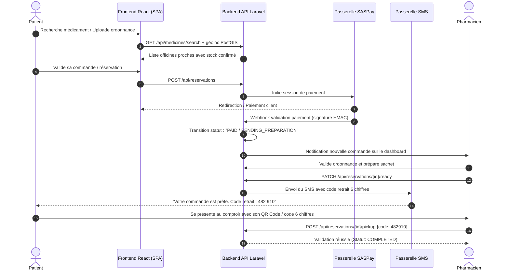

# 📚 PharmaConnect / MaPharma MVP — Spécification & Architecture Complète

> **Document de Référence Technique & Fonctionnel**  
> **Date de mise à jour :** 8 Septembre 2026  
> **Stack :** React 18 SPA (Vite) + Laravel 11 + PostgreSQL (PostGIS) + SASPay

---

## 1. 🎯 Vision & Problème Résolu

### 1.1 La Problématique
Dans l'accès aux soins quotidien, les patients et les pharmaciens font face à plusieurs frictions majeures :
- **Pénuries et ruptures de stocks imprévues** : les patients se déplacent physiquement d'officine en officine pour trouver un médicament prescrit.
- **Engorgement des comptoirs** : des files d'attente importantes se forment lors du déchiffrage et de la préparation manuelle des ordonnances complexes.
- **Incertitude sur les gardes** : difficulté à localiser avec certitude quelle officine est ouverte la nuit, les dimanches ou les jours fériés.

### 1.2 La Solution MaPharma / PharmaConnect
Une plateforme numérique de santé assurant le pont direct en temps réel entre le patient et les pharmacies partenaires :
1. **Disponibilité des stocks & géolocalisation** : savoir immédiatement où trouver le médicament au plus près.
2. **Télétransmission d'ordonnances** : téléverser une ordonnance pour qu'elle soit validée et préparée avant l'arrivée du patient.
3. **Réservation & paiement en ligne** : sécuriser son panier avec la passerelle SASPay.
4. **Retrait coupe-file express** : récupération en pharmacie en moins de 15 minutes grâce à un **QR Code** et un **code SMS de retrait à 6 chiffres**.

---

## 2. 👥 Les 3 Acteurs & Leurs Rôles

```
                    ┌─────────────────────────┐
                    │      ADMINISTRATEUR     │
                    │  (Validation & Stats)   │
                    └────────────┬────────────┘
                                 │
           ┌─────────────────────┴─────────────────────┐
           ▼                                           ▼
┌─────────────────────────┐                 ┌─────────────────────────┐
│     PATIENT / CLIENT    │ ◄── Réservations│    PHARMACIE PARTENAIRE │
│   (Recherche, Ordo,     │     & Retrait ──► (Préparation, Contrôle, │
│     Pass QR / SMS)      │                 │    Validation Délivrance)│
└─────────────────────────┘                 └─────────────────────────┘
```

### 2.1 Le Patient / Client (Front-end Public & Espace Utilisateur)
- Création de compte patient simplifiée (téléphone, nom, prénom, email).
- Moteur de recherche de médicaments par nom commercial, DCI (*Dénomination Commune Internationale*) et catégorie thérapeutique.
- Carte interactive géolocalisée affichant les officines partenaires et de garde à proximité.
- Module de télétransmission d'ordonnances (photos HD / documents PDF sécurisés).
- Gestion du panier et paiement en ligne sécurisé via **SASPay**.
- **Espace Patient personnel** :
  - Suivi des réservations en temps réel (*En attente*, *En préparation*, *Prête pour retrait*, *Clôturée*).
  - Génération du **Pass Retrait** (QR Code + Code SMS à 6 chiffres).
  - Historique des ordonnances et pharmacies favorites.

### 2.2 La Pharmacie Partenaire (Espace Officine)
- Dashboard dédié à la gestion des flux officinaux.
- Réception et notification des réservations entrantes en temps réel.
- Interface d'analyse et validation d'ordonnances (vérification des posologies et conformité).
- Modification du statut de préparation du sachet de médicaments.
- Validation finale du retrait au comptoir : saisie ou scan du code à 6 chiffres / QR Code client.
- Gestion du catalogue des stocks disponibles et calendrier des gardes de nuit/week-end.

### 2.3 L'Administrateur
- Validation, modération et certification officielle des nouvelles pharmacies inscrites.
- Tableau de bord des métriques globales (volume de réservations, taux de confirmation > 85%, taux de retrait > 90%).
- Supervision des transactions financières SASPay et des anomalies.

---

## 3. 🔄 Parcours Utilisateur Détaillé (Core Flow)



---

## 4. ⚙️ State Machine des Réservations

Pour garantir la fiabilité absolue des commandes, chaque réservation obéit à une machine à états stricte :

```
[PENDING_PAYMENT]
       │
       ▼ (Webhook SASPay reçu)
[PENDING_PREPARATION]
       │
       ▼ (Le pharmacien accepte & commence à préparer)
[IN_PREPARATION]
       │
       ▼ (Sachet prêt en réserve)
[READY_FOR_PICKUP] ──► [Notification SMS + QR Code générés]
       │
       ├─────────────────────────────────┐
       ▼ (Code 6 chiffres validé)         ▼ (Délai de garde dépassé)
  [COMPLETED]                        [CANCELLED / REFUNDED]
```

---

## 5. 🛠️ Architecture Technique Finale

### 5.1 Front-end (SPA)
- **Framework :** React 18 avec Vite.
- **Routing :** React Router v6 (routes publiques, protégées et dashboard).
- **State Management :** Zustand (panier persistant `cart-store`, état session `auth-store`).
- **Styles & UI :** Vanilla CSS + variables design tokens, responsive mobile-first, zéro émoji dans l'interface métier, icônes vectorielles SVG soignées.
- **Client HTTP :** Axios avec intercepteur d'injection automatique du Bearer Token (`Sanctum`) et capture d'erreurs 401.
- **Cartographie :** Leaflet / OpenStreetMap pour le repérage visuel des officines.
- **Paiement :** Intégration du composant de redirection / modal SASPay.

### 5.2 Back-end (API REST)
- **Framework :** PHP 8.2+ / Laravel 11.
- **Base de données :** PostgreSQL 16 avec extension spatiale **PostGIS** pour les requêtes de proximité géographique (`ST_DWithin`, `ST_Distance`).
- **Authentification :** Laravel Sanctum (tokens API pour la SPA).
- **Cache & Queues :** Redis 7 (gestion asynchrone de l'envoi des SMS et des notifications push).
- **Stockage Fichiers :** MinIO S3 en local / AWS S3 en production avec buckets sécurisés pour les ordonnances.
- **Sécurité :** Chiffrement des ordonnances, vérification stricte des signatures webhook SASPay (HMAC-SHA256).

---

## 6. 📅 Plan de Développement en 7 Jours (Roadmap)

| Jour | Objectifs Back-end (Laravel) | Objectifs Front-end (React SPA) | Livrables & Validation |
| :--- | :--- | :--- | :--- |
| **Jour 1** | Migrations PostgreSQL, Auth API, modèle OTP SMS | Setup Vite, React Router, Page Inscription & Connexion Patient | Inscription fonctionnelle, CI/CD validé |
| **Jour 2** | Modèle Pharmacies, extension PostGIS, endpoint géoloc | Carte Leaflet des pharmacies, filtres par distance et garde | Recherche d'officines interactive |
| **Jour 3** | State machine réservations, contrôleur panier | Store Zustand (panier), tunnel de commande, résumé panier | Réservation en base de données |
| **Jour 4** | Upload sécurisé d'ordonnances (S3), génération code 6 chiffres | Interface d'upload ordonnance, affichage Pass Retrait (QR Code) | Flux complet d'ordonnance testé |
| **Jour 5** | Webhooks SASPay, queues d'envoi SMS | Écran de redirection SASPay, Espace Patient (`/dashboard`) | Paiement sandbox fonctionnel |
| **Jour 6** | 40+ tests unitaires & d'intégration (Pest/PHPUnit) | Tests fonctionnels, optimisation perfs, audit Lighthouse > 80 | Rapport de tests au vert |
| **Jour 7** | Déploiement Heroku / VPS + PostgreSQL / Redis | Déploiement SPA sur Netlify avec redirection `_redirects` | **MVP 100% opérationnel en production** |

---

## 7. 🛡️ Bonnes Pratiques & Règles de Travail Git

1. **Isolation stricte de la branche `main`** :
   - Aucun commit ni push direct sur `main` ou `master`.
   - Développement exclusif sur des branches de fonctionnalités (ex. `feature/frontend-auth-otp`, `feature/patient-dashboard`).
2. **Pipeline d'Intégration Continue (CI/CD)** :
   - Pipeline GitHub Actions actif dans `.github/workflows/ci.yml`.
   - Contrôle systématique du formatage (`eslint`) et de la compilation (`vite build`) avant toute fusion.
